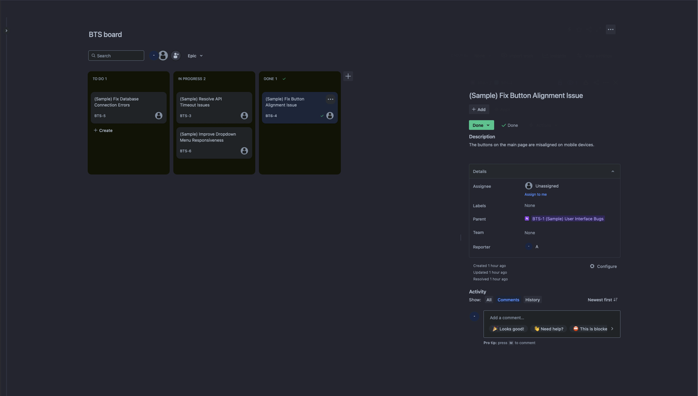

# userstyles

Some userstyles I have made. 

# How to install any of these 

1. Install the [Stylus](https://add0n.com/stylus.html) extension for your browser: [Chrome](https://chromewebstore.google.com/detail/stylus/clngdbkpkpeebahjckkjfobafhncgmne?pli=1), [Firefox](https://addons.mozilla.org/en-US/firefox/addon/styl-us/). 
2. Browse the list of styles below and click on the buttons "Install with Stylus". Stylus should open when you click the button to install it for you. 

# The styles 

## Jira Minimal 

Make Jira feel less heavy. 

Changes: 
- Make the kanban board look similar to Trello's. 
- Modified the color theme to [Dracula](https://draculatheme.com/contribute#color-palette) (I think the default color themes are a little ugly). 
- Buttons you may not use often, I made them almost invisible. Hover over them to see them.
- Add some padding to some of the elements to give them some room. 

[Install with Stylus](https://raw.githubusercontent.com/levibostian/userstyles/main/jira-minimal.user.css)